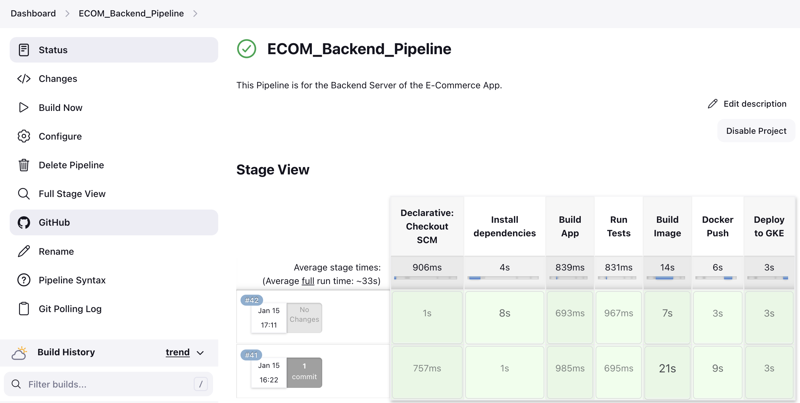
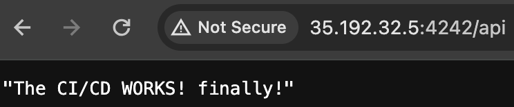

## Description
The aim of this project, is to build an e-commerce application with a functional payment system. The focus is on the core functionalities (order process incl. payment). After this is done, additional functionalities like cart, better UI design, detailed product view, etc. can be implemented.

My personal motivation here is to learn about React Native, TypeScript and also dive deeper into e-commerce.

Also, this app can be used as "framework" for an e-commerce app. The base is already here, just a few configurations like product import, adaption of design, etc. have to be done.

## Developers
mako.codeproducer@gmail.com

Please contact me, if you have any requests or questions.

## Setup
[Setting up the Environment Setup](https://reactnative.dev/docs/environment-setup)

After the setup is done, you can start the app via executing the command in the project folder "npm run ios" for iOS or "npm run android" for Android.

## Functionalities
// TODO: Add Screenshots of finished App.

## Learnings
### Expo vs. RN CLI
I decided to use React Native CLI for this project, because it has a bit more of a steeper learning curve.
Expo on the other hand is easier to setup.

### Fixing "rnsscreen was not found in the uimanager"
Executing the following commands worked for me -> [See Stackoverflow answer](https://stackoverflow.com/a/69740887)
: \
`npm i react-native-screens` \
`npx pod-install`

### Adding Icons to iOS
- `npm install react-native-vector-icons --save`
- [Do Steps 1-5](https://medium.com/@vimniky/how-to-use-vector-icons-in-your-react-native-project-8212ac6a8f06)
- Create the `react-native.config.js` file -> see [official documentation](https://github.com/oblador/react-native-vector-icons?tab=readme-ov-file#ios-setup)

### Fixing Minimum Deployment Target Error while installing Stripe SDK
- Go to ios/Podfile and change min_ios_version_supported to 13.0 -> [see link](https://github.com/stripe/stripe-react-native/issues/1280#issuecomment-1496494805)

### Client- and Serverside
It's important to separate the project structure into frontend and backend. I realized this, when I wanted to implement the logic for the stripe API. One example why it is necessary is the security aspect of an ecommerce app, which can be stored on a backend server, which is hosted on the internet. The client (mobile app) can then access via internet the server, which communicates with Stripe.

Here the payment process ([*click for source*](https://www.youtube.com/live/50bIefoMo3c?si=1kfK4tWuPRgNkbWF&t=356)): 

Setup Server:
- Create Backend Directory
- Create server.ts
- `npm init -y`
- `npm i express`
- `npm i nodemon -D`
- `npm install ts-node`

### Change iOS Emulator Record Screen Shortcut
- CMD+R is also the shortcut for reloading the React Native App -> [See answer](https://stackoverflow.com/a/68164574)

### Test API with CURL
curl -X POST -H "Content-Type: application/json" -d "{\"amount\":17950}" http://localhost:4242/payments/intents
OR: Use Postman.

### Cleanly separate the server startup logic from the application configuration
I split server.ts into server.ts and app.ts, because when testing, the Express server won’t be started, otherwise Express server gets started when testing and Jest is not exiting due to open handles. 

### Fix Requiring unknown module "undefined"
When starting the Frontend App, this error occurred. The reason for this was, that I changed directory names, but some changes were not adopted in the respective files.

### Fix TypeScript Error TS7016
If importing a JS Library into TS and type declaration is missing in this package, this error occurs.
Solution: [Click here](https://medium.com/@steveruiz/using-a-javascript-library-without-type-declarations-in-a-typescript-project-3643490015f3)

### Fix "Cannot find Module" for importing local image
You need to declare the type for .png/.jpeg in a separate .ts file, [see answer.](https://stackoverflow.com/a/63885623)

### Fix "onAnimatedValue no Listener registered" warning with navigation
Set an initial Route, [see answer.](https://github.com/react-navigation/react-navigation/issues/7839#issuecomment-689514906)

### Enable auto opening keyboard 
You need to disable the hardware keyboard in the simulator by pressing `CMD + K`

### Responsive App
- Insets: Use insets to determine the safearea for each device. for android, you need to add a multiplier.
- Margins/Paddings: Define it as much as possible with % instead of fixed values, to make it responsive for different screen sizes.

### Run on physical iOS Device
- !! Device and Mac need to be in the same network (Wifi or Hotspot)
- Connect device to Mac
- XCode -> Change to Physical Device
- Build and resolve (if there are any) warnings
- run command `npx react-native run-ios` (device in Xcode must be chosed, see step before)
- if URL Bundle error occurs while starting app -> Click on "Reload JS"

### Add custom bounce
- Debounce is useful for the search function, to improve performance. [See answer](https://stackoverflow.com/a/75556586).

### Interface vs. Types
- Interfaces are extensible and better reusable. Rule of thumb: Interface for OOP similarity (objects, products, users, etc.) and type for single uses, e.g. to define props of a function.

### Index.ts and Index.js -> fix XCode Release build
The index.js file needs to stay .js, otherwise XCode can't build the production release!

### Generating unique ids (UUID)
Date.now().toString() generates an unique identification, also known as UNIX Timestamp.

### Local images with require as number type
When you require a local image using the require syntax, the result is a reference to that image that React Native understands how to load. This reference is actually a numeric ID (of type number) that points to the image asset bundled within the app. This is why the type of a locally required image is number.

### Mismatch Reanimated version
The App crashed after installing BottomSheet. The solution: execute `pod install` in the ios folder, so Reanimated gets updated.

### State Management
It is important to implement a state management solution, when the app grows.
Because of the complexity of the app, I decided to use Provider Context API for this project.
When the app starts, user data is fetched from the server and stored in the context. This data is then used in the app.

### Setting Up Provider and Backend for Login
In this case, I decided to make my custom Login with a backend server.
In Production Environment it is necessary to use a secure and reliable authentication system, like Firebase or Auth0.
But for educational purposes, it serves it's purpose for this project.

## Setup CI/CD Workflow on GCloud for Backend
- [Tutorial: CI/CD for Node.js Application using Google Cloud](https://psspavan96.medium.com/ci-cd-for-node-js-application-using-google-cloud-part-1-5f7466df913d)

For Step 2, I created the VM instance, NOT with the "gcloud" command, but directly in the Web GCloud Console.

For Step 5a - 5e, use these commands to install Jenkins (see reference below):

- `sudo apt update`

- `sudo apt install openjdk-11-jre -y`

- `curl -fsSL https://pkg.jenkins.io/debian-stable/jenkins.io-2023.key | sudo tee \
    /usr/share/keyrings/jenkins-keyring.asc > /dev/null`

- `echo deb [signed-by=/usr/share/keyrings/jenkins-keyring.asc] \
    https://pkg.jenkins.io/debian-stable binary/ | sudo tee \
    /etc/apt/sources.list.d/jenkins.list > /dev/null`

- `sudo apt-get update`
- `sudo apt-get install jenkins -y`

For Step 7c - 7e, use these commands (see reference below):

Add Docker's official GPG key:

- `sudo apt-get update`
- `sudo apt-get install ca-certificates curl gnupg` 
- `sudo install -m 0755 -d /etc/apt/keyrings`
- `curl -fsSL https://download.docker.com/linux/ubuntu/gpg | sudo gpg --dearmor -o /etc/apt/keyrings/docker.gpg`
- `sudo chmod a+r /etc/apt/keyrings/docker.gpg`

Add the repository to Apt sources:
- `echo \
  "deb [arch=$(dpkg --print-architecture) signed-by=/etc/apt/keyrings/docker.gpg] https://download.docker.com/linux/debian \
  $(lsb_release -cs) stable" | sudo tee /etc/apt/sources.list.d/docker.list > /dev/null`
- `sudo apt-get update`

For Step 9, I created the Cluster via GCloud Console, see reference below.

For Step 10, I created a Jenkinsfile in the Gitrepo and access it directly there, see reference 7) below.

#### Notes
- Retrieve GCloud Jenkins Initial Pw: `cat /var/lib/jenkins/secrets/initialAdminPassword`
- ERR_TIMED_OUT Fix: I got this error, when I wanted to connect to the Jenkins server via external IP:8080. Important: **connect via http://** and NOT https://
- Jenkinsfile: In this case, I decided to create a Jenkinsfile directly in the Repo. You could write the script also directly in Jenkins, but for me it's more convenient to have a separate File in the Repo for the script.
- Fix "Failed to connect to repository" error in Jenkins: You need to connect your Github with Jenkins via a personal access token, see tutorial below. 
- Fix "npm not found" on Jenkins/GCloud: Jenkins showed this error during the build phase. The problem was, I didn't install npm and nodejs on the GCloud VM. Here the commands for installing: `sudo apt-get install npm` and `sudo apt-get install nodejs`
- Fix "ERROR: permission denied while trying to connect to the Docker daemon socket at unix:///var/run/docker.sock" -> run `chmod 777 /var/run/docker.sock` in GCloud console.
- Poll SCM: * * * * * -> which means the Jenkins polls the SCM every minute of every hour of every day of every month and every day of the week. It builds only, if there are new changes/commits. This is a possible solution, a better one would be, to use Github Webhooks, but in my case, I need to configure https. Because the server runs currently on http, I choose this solution.
- Fix GKE Authentication error: `gcloud compute instances set-service-account instance-1 --scopes=cloud-platform --zone=us-central1-a --service-account=ecom-980@e-com-project-408719.iam.gserviceaccount.com` The problem was the service account and the scopes were not set correctly, the previous command is the solution. Note: VM must be stopped, then the command executed, then the VM restarted.
- Connect to Google Kubernetes Cluster:
  - `gcloud container clusters get-credentials ecom-backend-cluster --zone us-central1-a --project e-com-project-408719`
  - `kubectl get deployments`
  - `kubectl get svc` -> get external IP
  - visit: http://{EXTERNAL_IP}:{PORT(4242)}
  - view logs: `kubectl get pods` -> `kubectl logs <pod>`
- Error Typescript: Locally it works with ts-node, but in Docker it does not. Now I changed the "node" command to `npx ts-node server.ts` (see Dockerfile). Difference to execute with npx: In the Dockerfile, npx ts-node server.ts runs the application using the locally installed ts-node, ensuring compatibility with the project's specific version. This approach avoids conflicts with globally installed versions, unlike the ts-node server.ts command which requires a global install using npm install -g ts-node.
- Fix Kubernetes Error "IP Adress Quota exceeded": `kubectl get services` to show all services and then `kubectl delete service <service-name>` to delete the previous services, which are not needed anymore.

#### Further Information, References
- [1) Setup and Install Jenkins on GCP VM](https://blog.kubekode.org/setup-and-install-jenkins-on-gcp-vm)
- [2) Install Docker Engine on Ubuntu](https://docs.docker.com/engine/install/ubuntu/)
- [3) Difference Jenkins/Github Actions](https://www.youtube.com/watch?v=VUspj9XPRBA)
- [4) Setup Kubernetes Cluster via GCloud Console](https://www.youtube.com/watch?v=p2LyoePiBo8)
- [5) Fix External IP Adress of GCloud Instance](https://cloud.google.com/compute/docs/ip-addresses/reserve-static-external-ip-address#console)
- [6) Add SSH Key to Jenkins for Github Private Repo](https://shreyakupadhyay.medium.com/integrate-jenkins-with-github-private-repo-8fb335494f7e)
- [7) Build Docker Image for NodeJS App / Jenkins](https://www.youtube.com/watch?v=Yo2yYxdBbfg)
- [8) How To Add GitHub Credentials In Jenkins](https://www.youtube.com/watch?v=fdkFrE09610)
- [9) Fix Typescript Error in Docker Node App](https://stackoverflow.com/a/67880948)

## Commands
Git: \
Reset last commit: `git reset --soft HEAD~1` 

VS Code (Mac):\
Duplicate line: SHIFT+OPTION+ARROWDOWN \
Reformat Code: SHIFT+OPTION+F

npm: \
Start iOS App: `npm run ios` \
Start Android App: `npm run android`

Xcode: \
Clean Build: SHIFT+COMMAND+K

Extentions VS Code:\
[React Code Snippets](https://marketplace.visualstudio.com/items?itemName=dsznajder.es7-react-js-snippets)

Webstorm:
Replace chars: `CMD + R`

## Sources/References
[React Native Tutorial](https://www.youtube.com/watch?v=w5IYCoTk4Bs&t=2859s) \
[React Native Tutorial 2](https://www.youtube.com/watch?v=qcN5B44cMHQ)

[Icon Library](https://oblador.github.io/react-native-vector-icons/)

[Setup Stripe](https://stripe.com/docs/payments/accept-a-payment)

[Project Structure Template](https://stackoverflow.com/a/51128385)

[Setup Express Server/Backend](https://www.youtube.com/watch?v=w3vs4a03y3I)

[Custom Image Carousel](https://www.youtube.com/watch?v=TANklYKCJe0)

## Tools for Development

- IDE: VS Code / Webstorm
- iPhone 15 Pro Simulator

## Projektdokumentation (Manual, Zusammenfassung, Repo, usw.)
